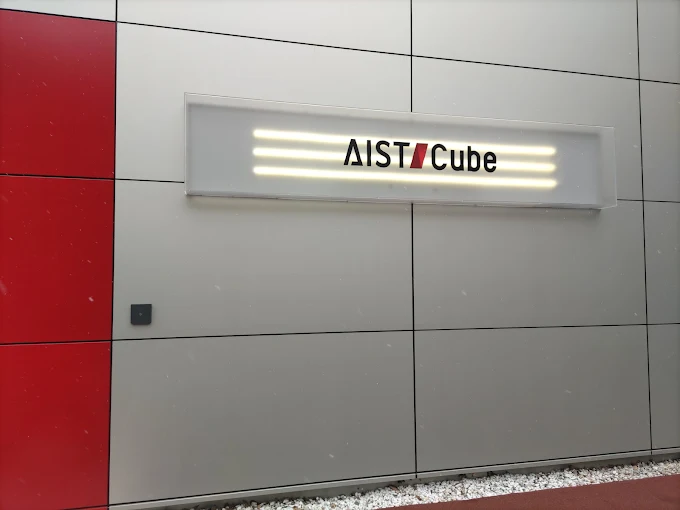
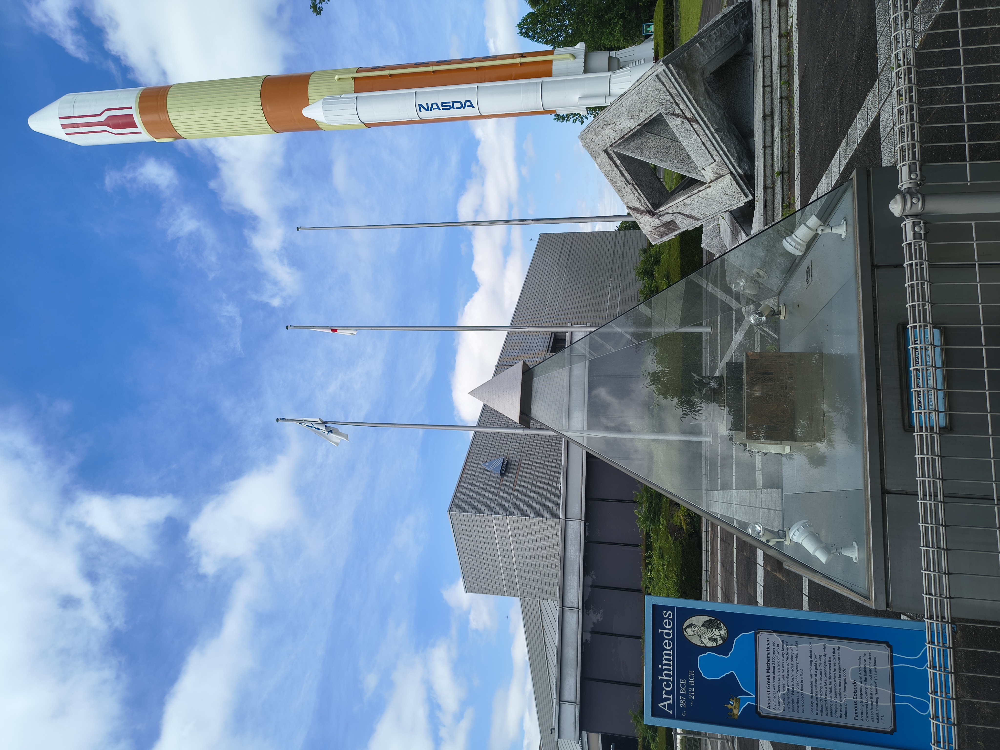
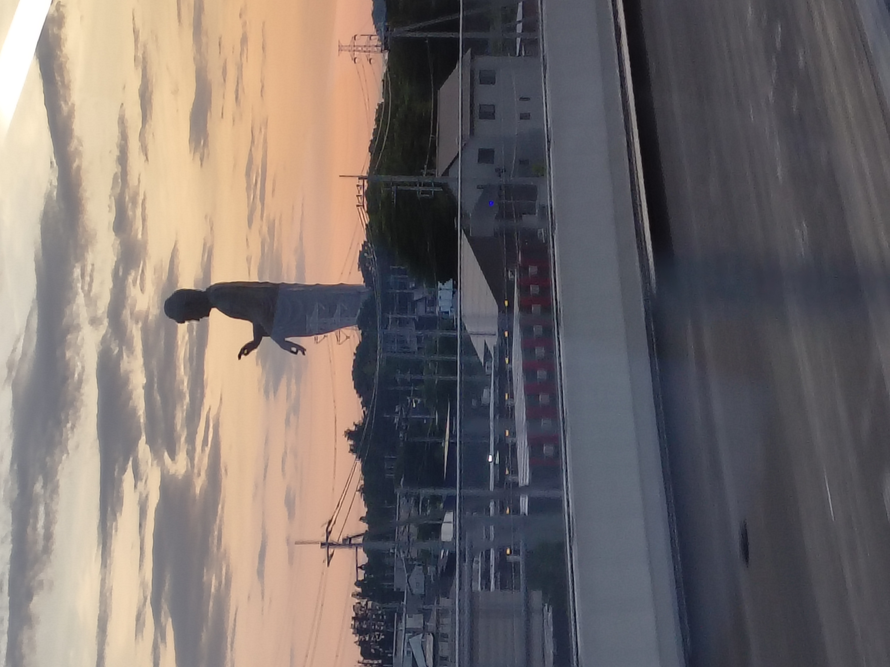
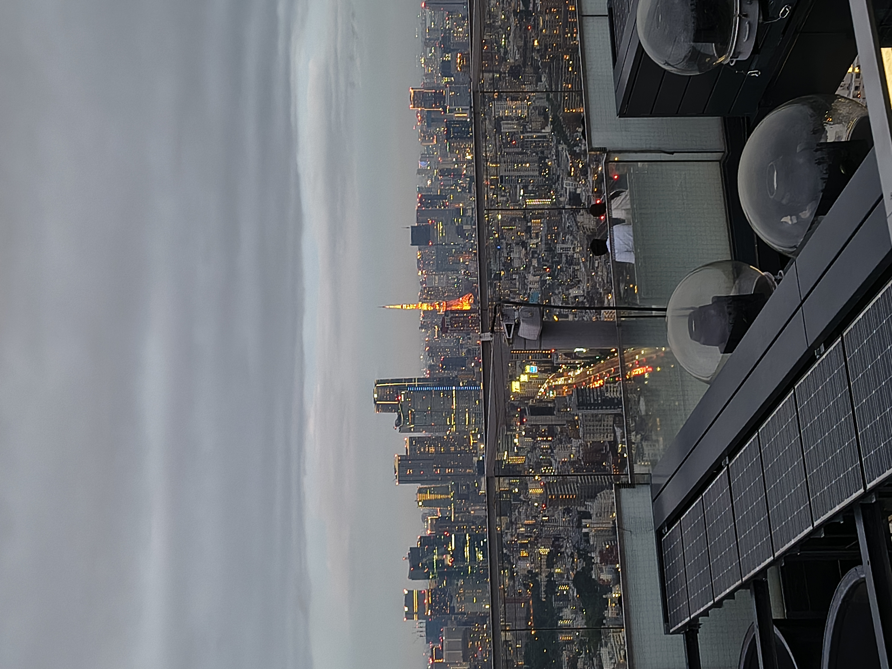
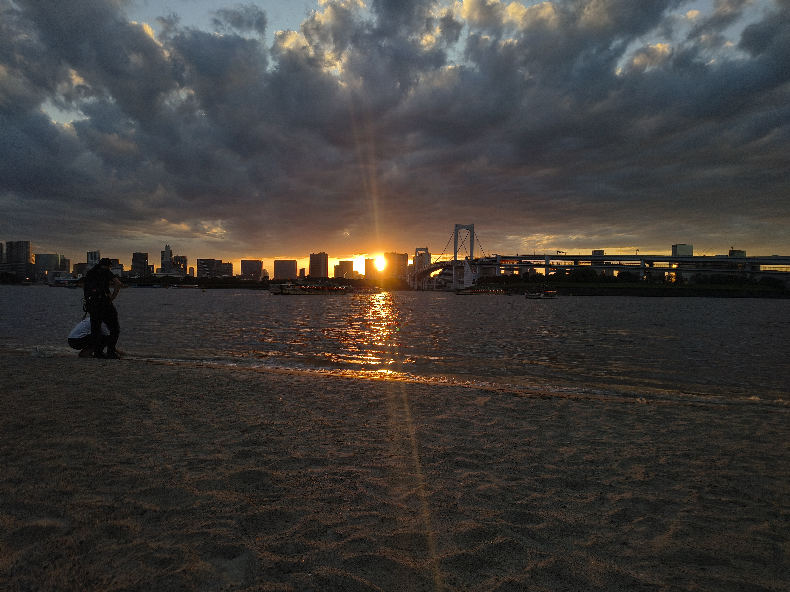
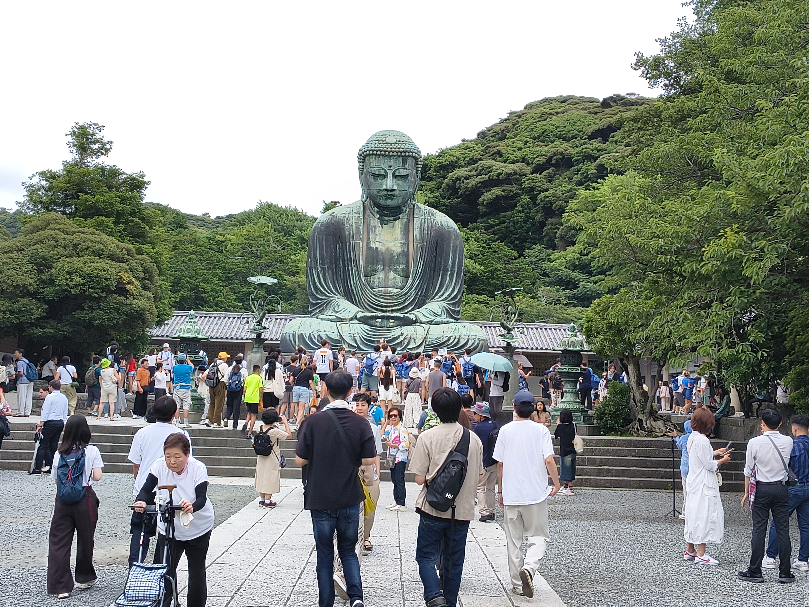
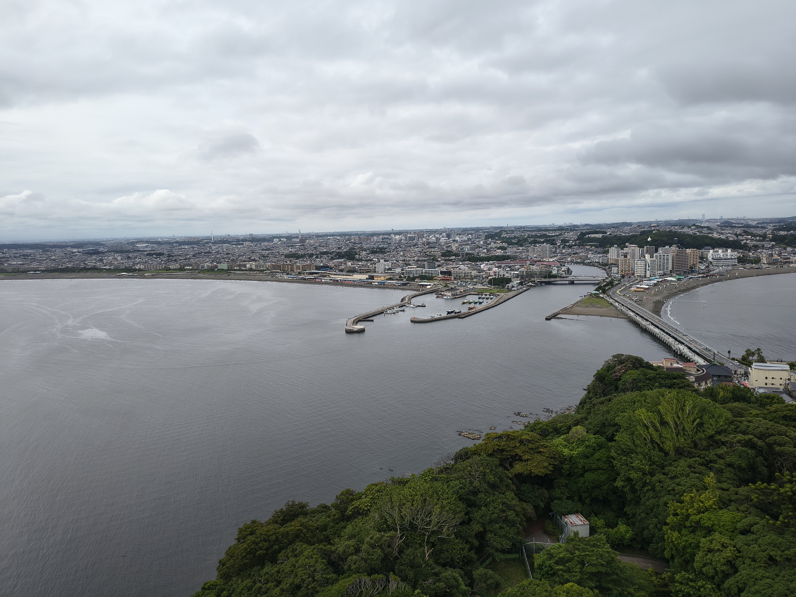
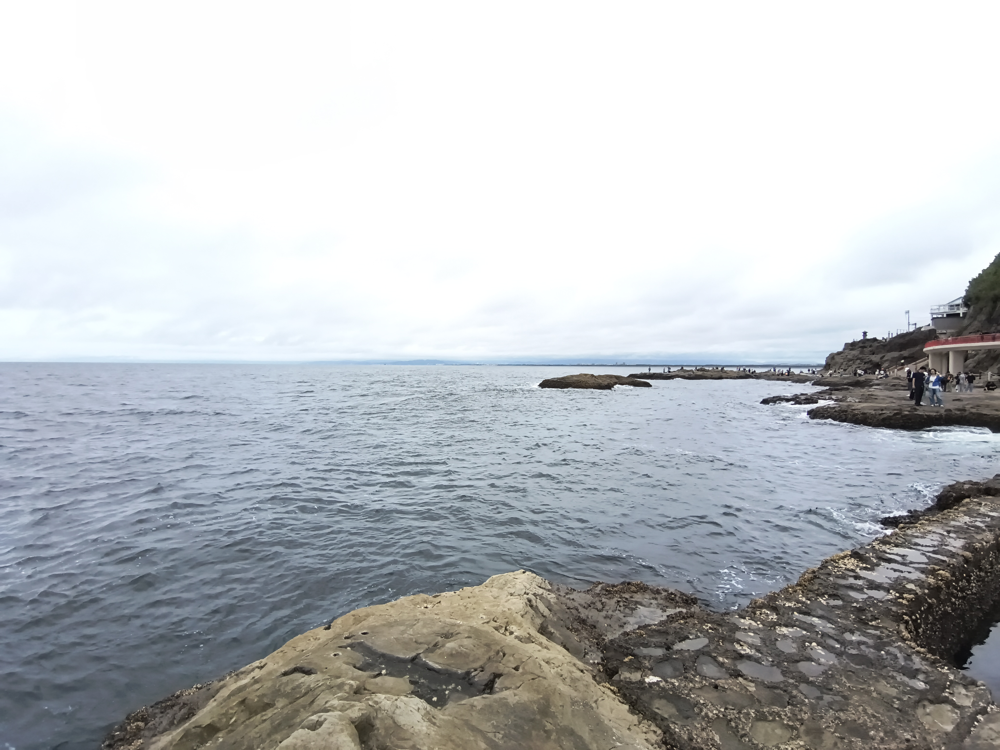
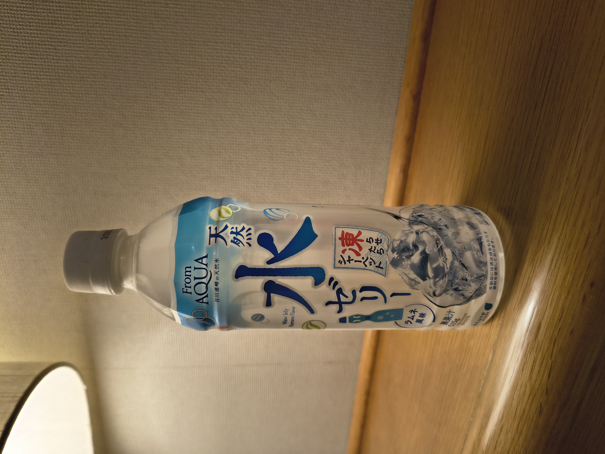

---
hide:
  - navigation
---

# Explore

A quick walkaround of places I visited beyond the lab, both around AIST and further out in Tokyo and Kanagawa. Not deep guides, just enough context to help you decide what's worth your weekend.

!!! tip "Trip planning"
    Any AI chatbot plus Google Maps is genuinely enough to get around Japan. Just don't forget to recharge your IC card and carry some cash without fail, it'll save you a lot of hassle.

!!! tip "Running low on battery?"
    **ChargeSPOT** rents out portable power banks, and their app shows nearby availability. These are generally available at convenience stores. The FamilyMart inside AIST has one too, so you can borrow and return it without leaving campus.

---

## Inside AIST

### AIST Cube (formerly AIST Science Square)

A short exhibition space in Central 1, right in front of the cafeteria, covering AIST's research and innovations across its various institutes. It's a quick visit, 30 to 45 minutes is enough to walk through, but a nice way to see what AIST actually works on.

<figure class="img-figure" markdown>
{ loading=lazy }
<figcaption>Entrance to AIST Cube</figcaption>
</figure>

!!! warning "Reservation required"
    Booking is compulsory and must be done online before 3 PM the day before your visit.

### Geological Museum

Right next to AIST Cube, and another easy stop for a short break between work. I'm not fully certain whether reservations are required here as well, so it's worth checking online before heading over.

---

## Around Tsukuba

- **JAXA Tsukuba Space Center**, no reservation needed if you're just visiting the general public facilities, and it's a walkable distance from AIST. The visit takes around an hour and is a must-visit spot. For the restricted-entry zone, you'll need to book at least two weeks in advance.

<figure class="img-figure" markdown>
{ loading=lazy }
<figcaption>JAXA Tsukuba Space Center</figcaption>
</figure>

!!! tip "Tsukuba Science Tour Bus"
    Takes you around several research facilities in one loop, worth trying, but plan the timing in advance. I personally haven't used it myself, though the route reportedly covers:

    - The Science Museum of Map and Survey, Geospatial Information Authority of Japan (GSI)
    - Tsukuba Botanical Garden, National Museum of Nature and Science
    - Tsukuba Expo Center
    - Geological Museum, National Institute of Advanced Industrial Science and Technology (AIST)
    - AIST Cube, National Institute of Advanced Industrial Science and Technology (AIST)
    - Tsukuba Space Center, Japan Aerospace Exploration Agency (JAXA)

- **Tsukuba Expo Center**, right next to Tsukuba Center. Probably a better fit for kids than adults. They run daily planetarium screenings, though when I visited, only Japanese-language shows were available.

<figure class="img-figure" markdown>
{ loading=lazy }
<figcaption>Tsukuba Expo Center</figcaption>
</figure>

- **CYBERDYNE Studio**, a fun stop if you're into robotics, located inside Iias Tsukuba. It's more of a small museum with a few live working exhibits than a full experience center, so I wouldn't recommend making a separate trip just for this. Works well combined with a mall visit.
- **Mount Tsukuba**, worth a visit if you enjoy hiking or scenic viewpoints, and one of the more prominent landmarks in the region.
- **Ushiku Daibutsu**, one of the largest Buddha statues in the world, set in a park. You'll likely pass near it anyway if you take the limousine bus to or from the airport.

<figure class="img-figure" markdown>
{ loading=lazy }
<figcaption>Ushiku Daibutsu, as seen from the limousine</figcaption>
</figure>

---

## Tokyo

Tokyo rewards repeat visits more than a single marathon day, so I ended up going back several times rather than trying to fit everything in once.

- **Tokyo Skytree**, one of the tallest structures in the city, with observation decks that give you a sense of just how sprawling Tokyo actually is.
- **Tokyo Tower**, the older, more classic counterpart to Skytree, and a nice contrast if you visit both.

<figure class="img-figure" markdown>
{ loading=lazy }
<figcaption>Tokyo Skytree</figcaption>
</figure>

- **Shibuya Sky**, lower in altitude than Tokyo Skytree, but the open-air observation deck makes the booking pain worth it. Read the instructions before going, since you'll need to store all your bags and belongings in the allotted locker.

<figure markdown>
{ loading=lazy }
<figcaption>The open-air deck at Shibuya Sky</figcaption>
</figure>

<figure markdown>
{ loading=lazy }
<figcaption>Tokyo Tower, seen from Shibuya Sky</figcaption>
</figure>

!!! tip "If you're carrying more than fits the locker"
    There's a JR coin locker on the ground floor, even before entering the mall, so no need to panic if your bags don't fit upstairs.

!!! warning "Shibuya Sky booking is genuinely difficult"
    The prime slot, 5:30 to 7:30 PM, gets booked within seconds of opening. Bookings open at exactly midnight, a fortnight before your visit date. Use the **official Shibuya Sky website** rather than Klook or other third-party apps. Third-party sites tend to lag by a couple of minutes, and that's enough time for peak slots to disappear.

- **Shibuya Crossing**, the famously chaotic pedestrian scramble, best experienced at least once in person, and also visible from up on Shibuya Sky.
- **Asakusa** and **Nakamise shopping street**, the old town feel of Tokyo, leading up to Senso-ji, lined with small shops selling snacks and souvenirs. The matcha latte with matcha ice cream and A5 wagyu here is definitely worth it, and there's no shortage of shops for Daruma dolls, chopsticks, lucky cats (maneki-neko), and other classic Japanese souvenirs.

<figure class="img-figure" markdown>
{ loading=lazy }
<figcaption>Nakamise shopping street leading to Senso-ji</figcaption>
</figure>

- **Ueno**, good for shopping and browsing, with a mix of markets and malls in the area.

<figure class="img-figure" markdown>
{ loading=lazy }
<figcaption>Ueno railway station</figcaption>
</figure>

- **Yodobashi Camera**, a massive electronics store chain, worth a visit even if you're not buying, just to see the scale of it.
- **Gundam statue**, **Miraikan**, **Odaiba Beach**, and **Rainbow Bridge** (visible from Odaiba Beach, worth catching at sunset), all clustered in the Odaiba area, worth combining into a single day since they're close together.

<figure class="img-figure" markdown>
{ loading=lazy }
<figcaption>The Gundam statue in Odaiba</figcaption>
</figure>

<figure class="img-figure" markdown>
{ loading=lazy }
<figcaption>Rainbow Bridge at sunset, from Odaiba Beach</figcaption>
</figure>

<figure class="img-figure" markdown>
{ loading=lazy }
<figcaption>Rainbow Bridge at night</figcaption>
</figure>

<figure class="img-figure" markdown>
{ loading=lazy }
<figcaption>The Earth, at the center of Miraikan</figcaption>
</figure>

!!! tip "Gachapon"
    Gachapon are Japanese capsule toys, dispensed from coin-operated vending machines. You'll find them almost everywhere in Tokyo and at every tourist spot.

---

## Others

### Kamakura & Enoshima Day Trip

A solid day trip if you want a mix of temples, coastline, and a bit of everything in between, and a nice break from the city if you've been doing mostly Tokyo so far.

- **Tsurugaoka Hachiman-gu**, the main shrine in Kamakura, and a good starting point for the day.

<figure class="img-figure" markdown>
{ loading=lazy }
<figcaption>Inside view, Tsurugaoka Hachiman-gu</figcaption>
</figure>

- **Komachi Street**, the shopping street leading up to it, lined with food stalls and small souvenir shops.
- **Great Buddha of Kamakura**, a large bronze statue and one of the more iconic sights in the area. You can actually go inside the statue as well.

<figure class="img-figure" markdown>
{ loading=lazy }
<figcaption>Great Buddha of Kamakura</figcaption>
</figure>

- **Hase-dera**, the second most worthwhile stop on this trip, known for its temple grounds and hydrangeas in season. The ocean view from up here is worth the climb.

<figure class="img-figure" markdown>
{ loading=lazy }
<figcaption>Ocean view from Hase-dera</figcaption>
</figure>

<figure class="img-figure" markdown>
{ loading=lazy }
<figcaption>Koi pond at Hase-dera</figcaption>
</figure>

- **Enoden**, the local train line connecting Kamakura to Enoshima, a scenic, must-ride part of the trip in itself.
- **Enoshima**, the highlight of the day, a small island connected to the mainland by a bridge.
- **Enoshima Sea Candle**, the observation tower on the island.

<figure class="img-figure" markdown>
{ loading=lazy }
<figcaption>View of Enoshima island from the top of the Sea Candle</figcaption>
</figure>

- The **shopping street** and the **bridge** leading onto the island, worth a slow walk rather than rushing across. This is also where you can pick up tako senbei, octopus crackers pressed flat right in front of you.
- **Chigogafuchi**, a rocky coastal spot with good views.

<figure class="img-figure" markdown>
{ loading=lazy }
<figcaption>View from Chigogafuchi</figcaption>
</figure>

- **Iwaya Caves**, a set of caves at the far end of the island.

<figure class="img-figure" markdown>
{ loading=lazy }
<figcaption>Iwaya Caves, from outside</figcaption>
</figure>

!!! note "Skip the Enoden 1-day pass unless you're doing multiple round trips"
    The pass wasn't particularly useful for me. Unless you're planning to go back and forth between Kamakura, Fujisawa, and Enoshima more than once in the day, buying individual tickets works out about the same and is one less thing to plan around.

!!! tip "Keep an eye out for AQUA Water Jelly"
    Not something you'll find in every vending machine. From what I've read online, railway station vending machines are the best bet. I got lucky in Fujisawa. Worth trying if you spot one.

<figure class="img-figure" markdown>
{ loading=lazy }
<figcaption>AQUA Water Jelly, found at a Fujisawa station vending machine</figcaption>
</figure>

### Mount Fuji

!!! tip "Check visibility before you go"
    Make sure the sky is clear before heading out. These two sites help confirm that:

    - [Visibility ranking, fuji-san.info](https://fuji-san.info/en/index.html){ target="_blank" }
    - [Live view, Yamanashi Kankou](https://www.yamanashi-kankou.jp/fujisanwatcher/live/index.html){ target="_blank" }

---

There's plenty more around Tokyo, Kanto, and beyond that I haven't listed here. These are just the spots that stood out enough to mention.