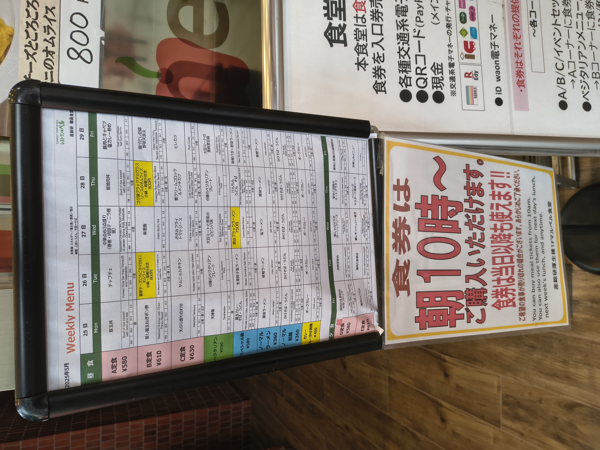
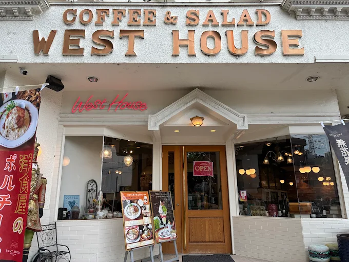
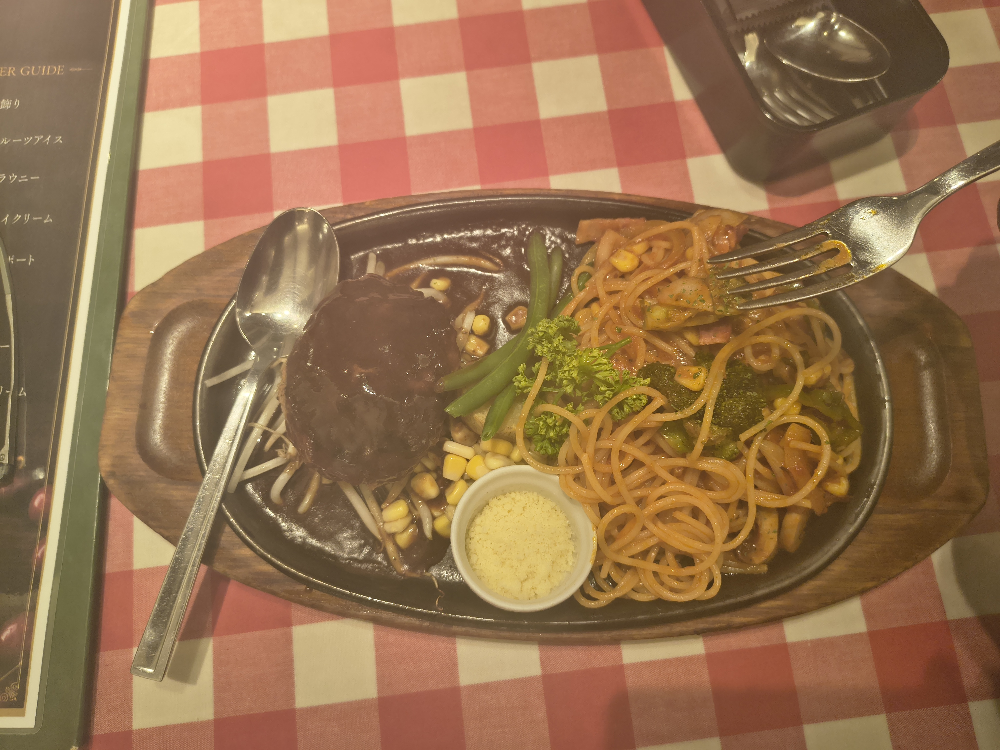
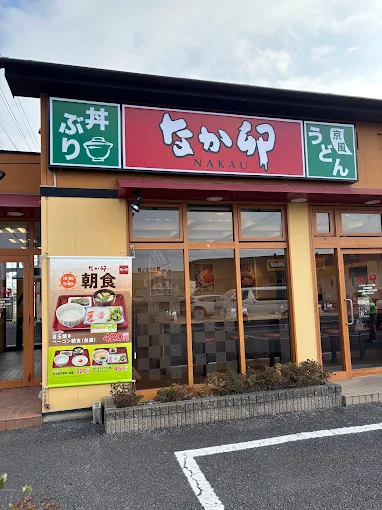
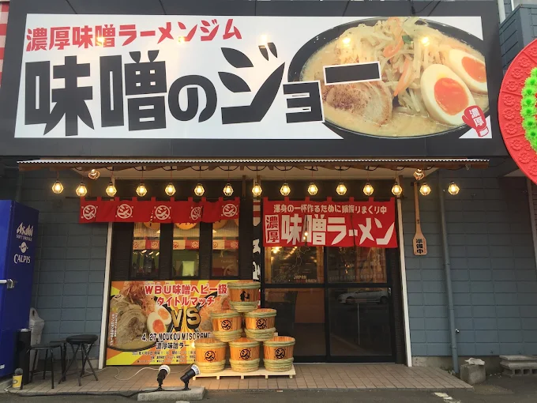
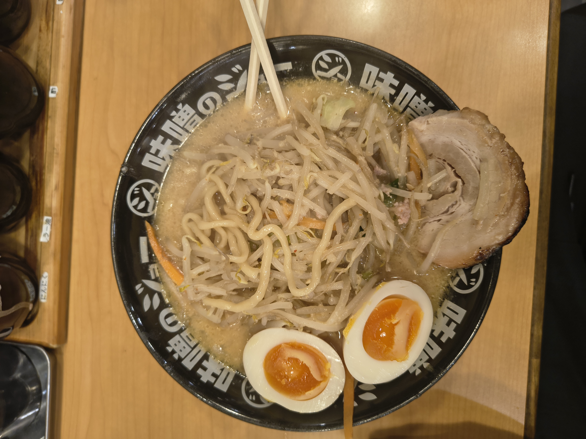
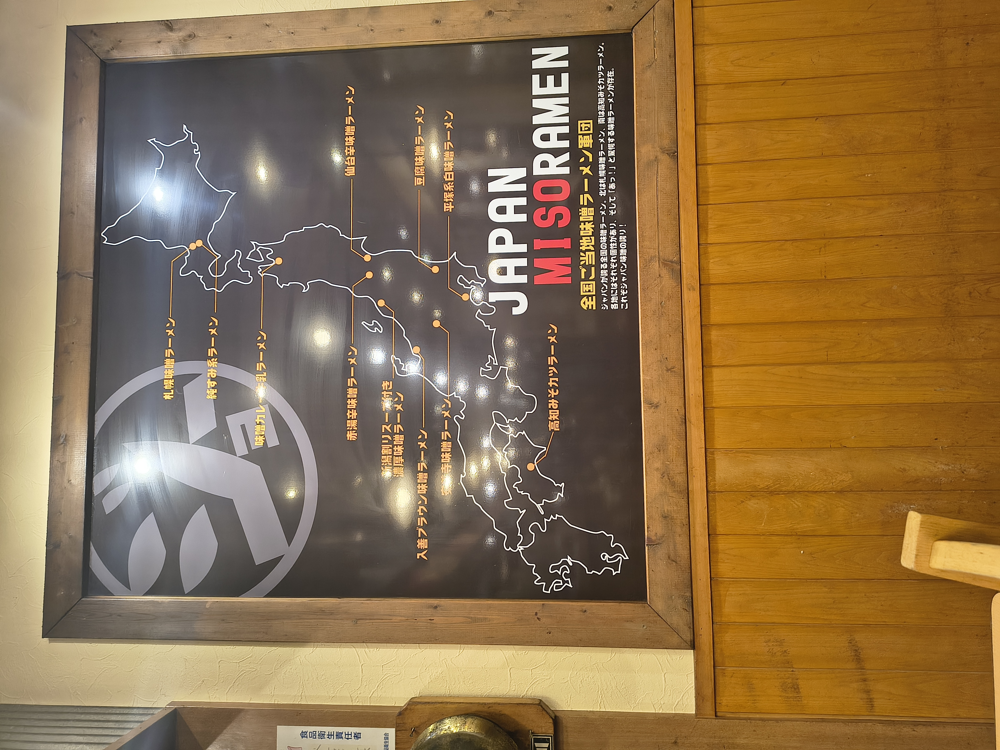
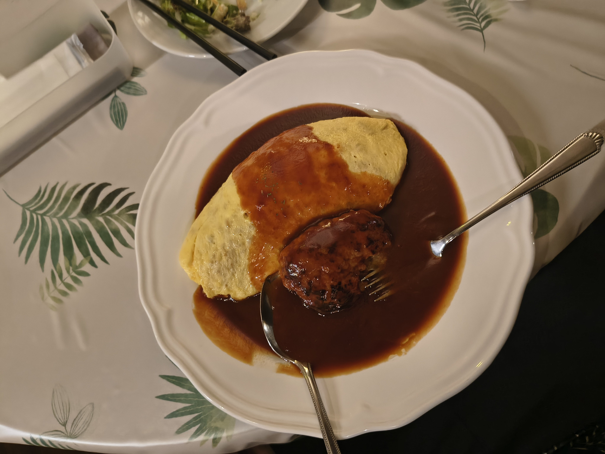
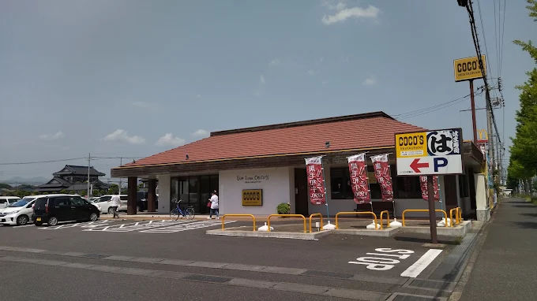

---
hide:
  - navigation
---

# Food

This page covers the food options inside AIST, along with restaurants I've tried around Tsukuba.

!!! tip "Find restaurants with TableLog"
    TableLog is a solid app for finding restaurants in Japan, rated on a scale of 5 with multilingual support. Anything above 3 is usually very reliable, and listings often include payment details too.

!!! warning "Cash is still king in many places"
    Plenty of restaurants still don't accept cards, so it's worth checking in advance or just carrying cash as a backup.

---

## Inside AIST

### Welfare Center Cafeteria

The main cafeteria on campus, with limited hours: it closes at **6:20 PM**. The menu changes weekly and is posted at the entrance.

You'll find **three set menus**, a few noodle options (ramen, udon, soba), curry rice, and assorted side dishes, plus green tea.

**Payment:** Pay at the kiosk with cash or electronic money (IC card, PayPay, etc.) and hand over the token to receive your food. Since everything is served buffet-style, there's almost no wait beyond the queue itself.

!!! tip "Avoid the lunch rush"
    The lunch bell rings at 12:00 noon, and the place gets crowded for about 20 minutes, roughly 12:00 to 12:20 from my experience. Visit before or after that window to skip the queue, though the set menus might be sold out later in the day.

<figure class="img-figure" markdown>
{ loading=lazy }
<figcaption>A random week's menu board</figcaption>
</figure>

### Welfare Annex B Cafeteria (Cafe Piquenique)

Closes at **7:00 PM**. Weekly menus and any changes to timing are posted on [their blog](https://ameblo.jp/bshokudo/entrylist.html){ target="_blank" }, and it's also listed on TableLog.

**Payment:** Pay at the vending machine with cash or electronic money (IC card, PayPay, etc.), hand over the token, and you'll be called to collect your food once it's ready.

Personally, I found Cafe Piquenique leaned more toward pasta-based dishes than a typical set-menu cafeteria.

### Coffee Factory R&D Cafe

In Central 2. Open **10 AM to 6 PM**. More of a proper cafe than a cafeteria, with one lunch dish plus snacks and drinks. Also listed on TableLog.

**Payment:** Handled at the reception counter, and all payment methods are accepted.

Personally, I'd describe it as Japanese-flavored Western dishes rather than traditional Japanese food. If you're after the real thing inside AIST, the Welfare Center Cafeteria is the better option.

---

## Around Tsukuba

All of these were found through TableLog, and there are plenty more still to discover.

### West House

A Western food spot, I tried pasta with hamburg steak and found the service solid, with staff who actually spoke English. Located toward the exit of Doho Park.

<figure markdown>
{ loading=lazy }
<figcaption>West House</figcaption>
</figure>

<figure markdown>
{ loading=lazy }
<figcaption>Food at West House</figcaption>
</figure>

!!! note "On pricing"
    Most Western-style Japanese restaurants I visited landed around ¥1,500 a meal.

### Nakau

The easiest restaurant to navigate. Serves udon and gyudon, and the udon I tried was quite good. The best part is that ordering happens through a tablet (English available), and payment is computerized: you walk up to the machine, scan your bill, and pay.

Located in Higashi.

<figure class="img-figure" markdown>
{ loading=lazy }
<figcaption>Nakau</figcaption>
</figure>

!!! tip "Nearby options"
    The Kasumi food market and Welcia drugstore are right next door, worth checking out since the 7-Eleven near AIST and the FamilyMart on campus are both fairly small.

!!! note "A couple of things I noticed"
    I recall it being mentioned as a 24-hour restaurant, though I'm not fully sure. After 10 or 11 PM, a 10% late-night surcharge seems to apply. Also, don't throw away the receipt, since it sometimes doubles as a coupon.

!!! note "General experience"
    Most Japanese restaurants serving ramen and similar dishes will bring you green tea automatically on arrival.

### Miso no Jyo Tsukuba

A ramen restaurant.

**Payment:** Pay at the vending machine with cash or electronic money (IC card, PayPay, etc.) and hand over the token to receive your food.

<figure markdown>
{ loading=lazy }
<figcaption>Miso no Jyo Tsukuba</figcaption>
</figure>

<figure markdown>
{ loading=lazy }
<figcaption>Food at Miso no Jyo Tsukuba</figcaption>
</figure>

<figure markdown>
{ loading=lazy }
<figcaption>Vending machine at Miso no Jyo Tsukuba</figcaption>
</figure>

<figure markdown>
{ loading=lazy }
<figcaption>Ambience at Miso no Jyo Tsukuba</figcaption>
</figure>

!!! tip "Vending machine tickets are common"
    Most ramen restaurants in Japan use this same vending machine ticket system, so it's worth getting comfortable with it early.

!!! note "On pricing"
    Ramen and udon typically run around ¥900, sometimes a bit more in Tokyo.

### Maru

A Western restaurant. I had omelet rice, and beyond the food, the interior design stood out. Note that it keeps a different schedule depending on the day of the week, so check before heading over, and it doesn't accept cards.

Ordering is simple: just point to what you want on the menu card and it'll be served.

<figure markdown>
{ loading=lazy }
<figcaption>Maru</figcaption>
</figure>

<figure markdown>
{ loading=lazy }
<figcaption>Food at Maru</figcaption>
</figure>

<figure markdown>
{ loading=lazy }
<figcaption>Ambience at Maru</figcaption>
</figure>

!!! tip "Reading Japanese menus"
    Most menus and vending machine screens will be in Japanese. I'd recommend installing **Kuli Kuli**, which I found better suited to this than Google Translate.

### Denny's

Quite far from AIST, so cycling makes the trip easier. You'll find this chain in almost every city in Japan, and the omelet rice here is a solid choice. The shop was fairly full when I visited, so I skipped taking photos. Another Western-Japanese option.

<figure class="img-figure" markdown>
{ loading=lazy }
<figcaption>Denny's</figcaption>
</figure>

### Coco's

The best spot if you're eating late. Most restaurants close by 9 PM, but Coco's stays open until **2 AM**. Another Western-Japanese spot, and the hamburg steak is worth trying. Located in Higashi, opposite Nakau.

The beef curry rice is a dependable standard order. There's a kids' menu, an English menu, and a solid range of desserts too.

<figure class="img-figure" markdown>
{ loading=lazy }
<figcaption>Coco's</figcaption>
</figure>

### Sushi Dokoro Yagura Tsukuba Honten

An authentic sushi spot with an atmosphere that genuinely feels like something out of Shin-chan or Doraemon. You'll be served green tea (refilled for free) and a warm towel on arrival. Prices run on the higher side, and I'd suggest bringing along someone who reads Japanese, since the menu is huge. Definitely worth a visit.

### McDonald's

Went in for the standard burgers, at the outlet inside the food court of Iias Tsukuba. There are several locations around, including one near Tsukuba Center. The menu is the usual global lineup, plus a few Japan-specific items like the teriyaki burger.

The teriyaki burger is worth trying, but go for the double patty. The single patty wasn't very filling.

### MOS Burger

A Japanese burger chain, as far as I know. Found this one in the food court of the mall next to Tsukuba Center. I tried the teriyaki burger again here, and found it noticeably more filling and flavorful than the McDonald's version, for around ¥920.

!!! tip "Returning trays"
    When eating at food courts in Japan, you're expected to return your tray to the shop you bought your food from.

---

I also tried a fair amount of Japanese cuisine while visiting tourist spots. You'll find those write-ups in the [Explore section](explore.md), alongside the places I visited.

!!! tip "Food delivery"
    Uber Eats is available, and orders get handed over in the Sakura-kan lobby. Expect the usual delivery markup of about 15 to 20% over in-restaurant pricing. Grab is also available in the area, though I haven't personally used it.